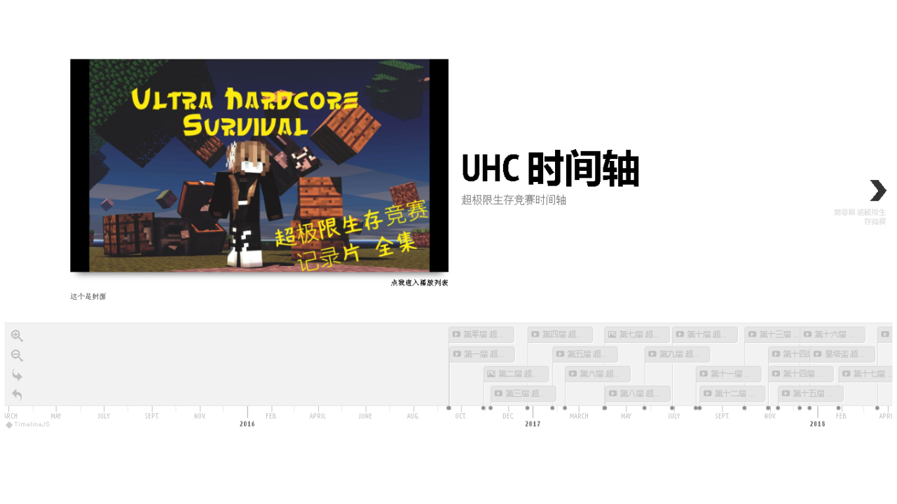

### Hosted by:

# Side Project —— UHC 時間軸
- forked from [this repo](https://github.com/Digital-Humanities-Toolkit/timeline-builder)
- 同樣也是沒事做的時候，做出來的產物。
- 更多的情況，其實就只是為了學一下github的fork功能而已。

# 主要内容：
### 
- 以時間軸的方式來排UHC的舉辦日期。

# 目前进度：
- Index：
